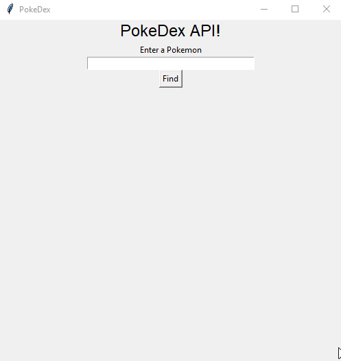

PokeDex App
A simple PokeDex application built with Python and Tkinter that retrieves Pokémon information from the PokéAPI.

Features
Search for any Pokémon by name

Displays Pokémon type(s)

Shows base stats including:

HP

Attack

Defense

Special Attack

Special Defense

Speed

Total stats

Displays the Pokémon's sprite image

Simple and intuitive GUI

Requirements
Python 3.x

tkinter (usually comes with Python)

requests library (pip install requests)

Pillow library (pip install pillow)

Installation
Clone this repository:

bash
git clone https://github.com/JJhart/pokedex-app.git
cd pokedex-app
Install the required dependencies:

bash
pip install requests pillow
Run the application:

bash
python pokedex.py
Usage
Enter a Pokémon name in the text field

Click the "Find" button

View the Pokémon's information including type, stats, and sprite

Code Structure
Uses the PokéAPI to fetch Pokémon data

Tkinter for the graphical user interface

Displays stats in a clean, organized layout

Shows error messages if Pokémon isn't found

Example

Search for "pikachu" to see:

Type: Electric

All base stats

Pikachu's sprite image

Contributing
Contributions are welcome! Please open an issue or pull request for any improvements.

License
This project is open source and available under the MIT License.

Note: This application is for educational purposes and uses the PokéAPI.
